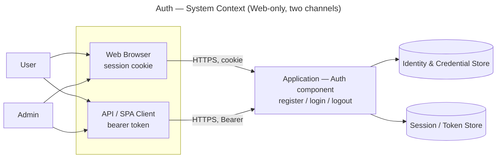
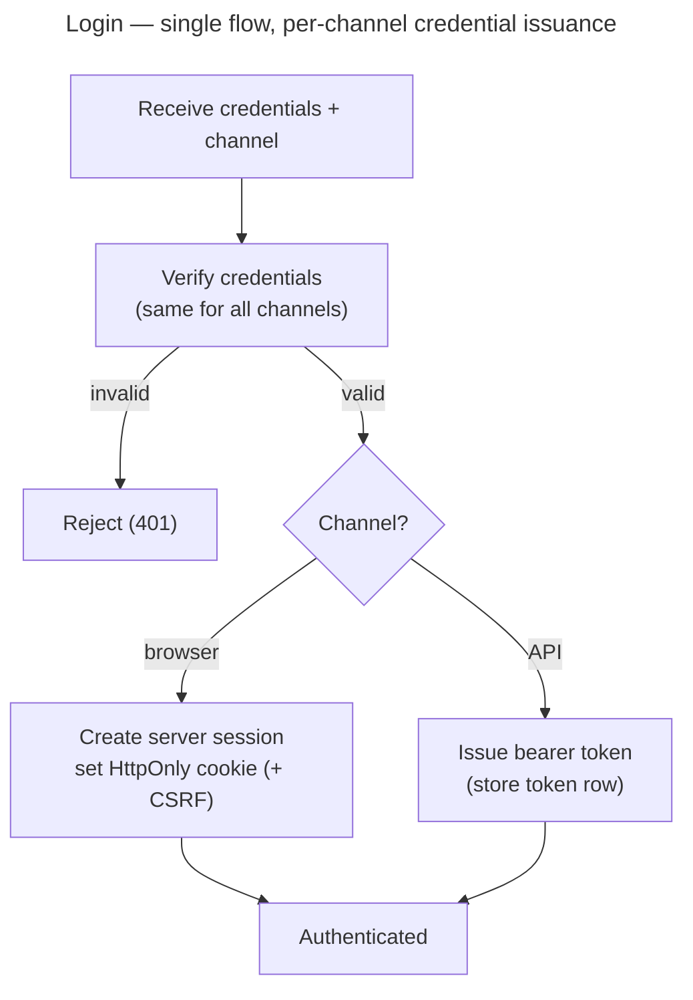

# Auth — Context (Environment)

Defines the **environment the Auth component runs in**. This is shared by all three
levels (modular-monolith / module / microservice) — it describes *where* Auth lives
and *who/what* talks to it, not *how* the code is split (that is each level's job).

## Scope (frozen)

- **In:** Register, Login, Logout
- **Out / deferred:** authorization (separate `authorization/` component), reset
  password, email verification, 2FA, social login
- Detailed behaviour + acceptance criteria live in `user-stories.md`.

## Application environment

| Aspect | Now | Later (noted, not built) |
|---|---|---|
| Application type | **Web only** | Mobile app |
| Client channels | Browser, API/SPA client | Native mobile |
| Transport | HTTPS | HTTPS |
| Deployment | single application | may split (see level docs) |

## Actors

| Actor | Description |
|---|---|
| **User** | A registered person using the application. |
| **Admin** | A privileged person. Authenticates like a User; the privilege itself is an authorization concern (separate component). |
| **Guest** | Not authenticated yet. Can register and log in. |

## Client channels

The application is reached through **two channels**, and the channel decides what
credential Login issues:

| | Web (session) | API (token) |
|---|---|---|
| Used by | server-rendered browser pages | SPA / future mobile |
| Where auth state lives | server session store | token row (stored server-side) |
| Carrier | HttpOnly cookie | `Authorization: Bearer <token>` |
| CSRF protection | required | not required (no cookie) |
| Logout means | invalidate the session | revoke the token row |

## Authentication model (the key decision)

**Login is one flow.** The channel is an input that selects a **credential-issuance
sub-process** (a pluggable strategy) at the last step. Verify-credentials is written
**once**; only credential issuance varies by channel.

Why this shape:
- **DRY** — credential verification exists once.
- **OCP / strategy** — the credential issuer is selected by channel; adding a new
  channel (mobile) is an *insert*, not an edit to the verify logic.
- Separates two ideas that are easy to conflate: **authentication** (who you are)
  vs **credential transport** (how the proof is carried).

## Assumptions & constraints

- HTTPS everywhere; passwords stored **hashed** (never plain text).
- Public identifiers are **opaque and non-enumerable** (no raw incremental ids).
- Web-only today — mobile is acknowledged but not designed.

## Cross-cutting dependencies

Auth depends on shared **infra components** designed separately. Auth *references*
them; it never owns their rules. Dependencies are **one-directional** — infra
components never depend on Auth.

| Dependency | Type | What Auth uses it for | Owned by |
|---|---|---|---|
| **Rate-Limiting** | infra component (separate) | throttle login / register / logout (per-identity + per-IP) | `rate-limiting/` (to be designed) |

Policies that stay **inside** Auth (its own domain, expressed as config, not hardcoded):

| Policy | Form | Default |
|---|---|---|
| Password policy | config value | min 8 chars, no forced composition; breach-list check deferred |

Note: **Authorization** (roles/permissions) is also separate, but it is a *peer
domain component*, not a dependency of base Auth — Auth answers "who are you", Authz
answers "what may you do".

## Why the channel choice matters at higher levels

Session state is **stateful** (tied to a server-side store); tokens can be made
**stateless**. This distinction barely matters in Level 1 (one app, one store) but
becomes a central trade-off at Level 3 (microservice), where a shared session/token
lookup couples every service to the auth datastore. Each level's `architecture.md`
revisits it — `context.md` only fixes that **both channels exist**.

## Deferred questions (decide when their component/level arrives)

- Token format per level: opaque server-stored token vs stateless JWT.
- Token/session lifetime and revocation strategy.
- Admin vs User: decided — a single account; admin is an authorization role (see
  `data-model.md`).
