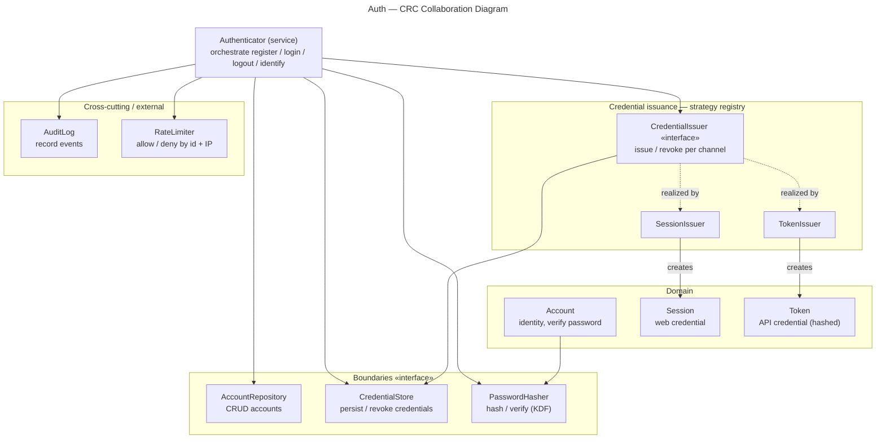

# Auth — CRC Cards

Class–Responsibility–Collaborator cards for the Auth domain objects.
Level-independent: these are the *roles*, not their wiring (that is each level's job).

The diagram shows **who collaborates with whom**; the cards below hold each object's
full responsibilities.

### Authenticator (service)
- **Responsibilities:** orchestrate register / login / logout / **identify** (resolve the
  account behind a request); verify credentials; select the credential issuer by channel;
  emit audit events; consult the rate limiter.
- **Collaborators:** AccountRepository, PasswordHasher, CredentialIssuer (registry),
  CredentialStore, AuditLog, RateLimiter.

### Account
- **Responsibilities:** represent a registered identity (login identifier(s), password hash, status,
  opaque public id); never expose the raw password.
- **Collaborators:** PasswordHasher (to verify a candidate password).

### PasswordHasher «interface»
- **Responsibilities:** hash a plaintext password with a slow KDF; verify a candidate
  in constant time.
- **Collaborators:** — (leaf).

### CredentialIssuer «interface»
- **Responsibilities:** create a Credential for one channel; revoke it on logout.
- **Collaborators:** CredentialStore.
- **Implementations:** SessionIssuer (web), TokenIssuer (API).

### Credential «abstract»
- **Responsibilities:** prove an authenticated identity on later requests.
- **Collaborators:** —.
- **Variants:** Session (cookie-backed), Token (bearer, stored hashed).

### AccountRepository «interface»
- **Responsibilities:** find / store accounts — pure CRUD, no business rules.
- **Collaborators:** — (sealed data boundary; transactions live in the service).

### CredentialStore «interface»
- **Responsibilities:** persist and look up sessions / tokens; support revocation.
- **Collaborators:** —.

### AuditLog «interface» (cross-cutting)
- **Responsibilities:** record register / login / logout events.
- **Collaborators:** — (may become its own component later).

### RateLimiter «interface» (external)
- **Responsibilities:** allow / deny an attempt by identity and IP.
- **Collaborators:** — (owned by `rate-limiting/`; referenced, not built here).
