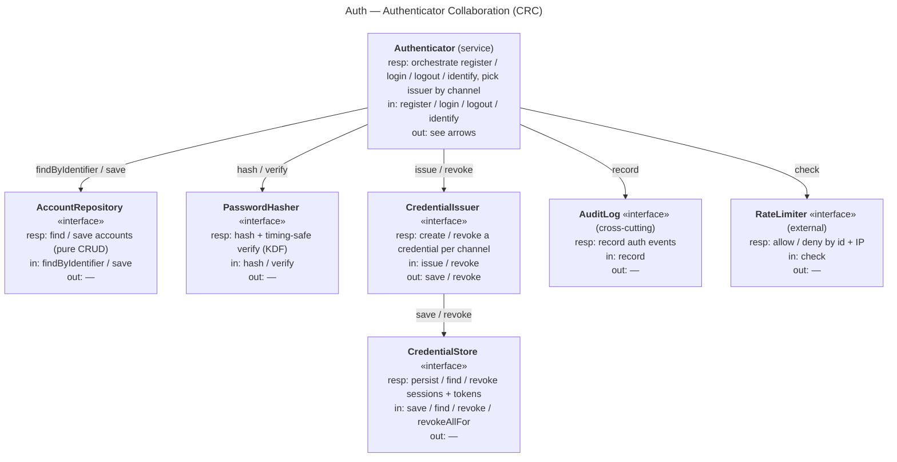
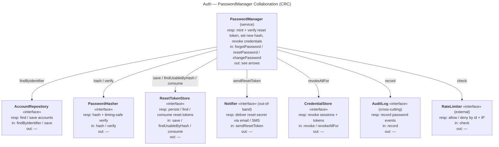

# Auth — CRC Cards

Class–Responsibility–Collaborator cards for the Auth domain objects, in the
message-oriented CRC style: each card shows **Responsibilities**, **Messages In** (what
triggers it) and **Messages Out** (what it sends). Level-independent — these are the
*roles*, not their wiring (that is each level's job).

Each card is drawn as a node on a **collaboration board**; the arrows are the messages
(a *message out* of one card is a *message in* to another). Two boards — one per service
— share the same boundary cards, so the cards sit near their collaborators.

> Note: Mermaid has no first-class `crcDiagram` yet, so the cards are rendered as
> flowchart nodes (responsibilities + messages in / out inside each node).

## Board 1 — Authenticator collaboration (register / login / logout / identify)

## Board 2 — PasswordManager collaboration (forgot / reset / change)

---

## Cards (full responsibilities)

### Authenticator (service)
- **Responsibilities:** orchestrate register / login / logout / **identify** (resolve the
  account behind a request); verify credentials; select the credential issuer by channel;
  emit audit events; consult the rate limiter.
- **Messages in:** register, login, logout, identify.
- **Messages out:** findByIdentifier / save (Repository), hash / verify (Hasher),
  issue / revoke (Issuer), record (Audit), check (RateLimiter).
- **Collaborators:** AccountRepository, PasswordHasher, CredentialIssuer, AuditLog,
  RateLimiter.

### PasswordManager (service)
- **Responsibilities:** own forgot / reset / change password; mint and verify the
  single-use reset token; set the new password hash; revoke credentials after a change;
  emit audit events; consult the rate limiter.
- **Messages in:** forgotPassword, resetPassword, changePassword.
- **Messages out:** findByIdentifier (Repository), hash / verify (Hasher),
  save / findUsableByHash / consume (ResetTokenStore), sendResetToken (Notifier),
  revokeAllFor (CredentialStore), record (Audit), check (RateLimiter).
- **Collaborators:** AccountRepository, PasswordHasher, ResetTokenStore, Notifier,
  CredentialStore, AuditLog, RateLimiter.

### Account
- **Responsibilities:** represent a registered identity (login identifier(s), password
  hash, status, opaque public id); never expose the raw password.
- **Messages in:** verify (a candidate password).
- **Messages out:** verify (delegates the KDF check to PasswordHasher).
- **Collaborators:** PasswordHasher.

### ResetToken
- **Responsibilities:** a single-use, time-limited recovery secret bound to one account;
  stored **hashed**; know whether it is still usable (not expired **and** not consumed).
- **Messages in:** isUsable.
- **Messages out:** —.
- **Collaborators:** — (leaf; persisted via ResetTokenStore).

### PasswordHasher «interface»
- **Responsibilities:** hash a plaintext password with a slow KDF; verify a candidate in
  constant time.
- **Messages in:** hash, verify.
- **Messages out:** —.
- **Collaborators:** — (leaf).

### CredentialIssuer «interface»
- **Responsibilities:** create a Credential for one channel; revoke it on logout.
- **Messages in:** issue, revoke.
- **Messages out:** save, revoke (CredentialStore).
- **Collaborators:** CredentialStore. **Implementations:** SessionIssuer (web),
  TokenIssuer (API).

### Credential «abstract»
- **Responsibilities:** prove an authenticated identity on later requests.
- **Messages in:** —.
- **Messages out:** —.
- **Variants:** Session (cookie-backed), Token (bearer, stored hashed).

### AccountRepository «interface»
- **Responsibilities:** find / store accounts — pure CRUD, no business rules.
- **Messages in:** findByIdentifier, save.
- **Messages out:** —.
- **Collaborators:** — (sealed data boundary; transactions live in the services).

### ResetTokenStore «interface»
- **Responsibilities:** persist reset tokens; find a *usable* one by hash; consume on use.
- **Messages in:** save, findUsableByHash, consume.
- **Messages out:** —.
- **Collaborators:** — (sealed data boundary).

### CredentialStore «interface»
- **Responsibilities:** persist / look up sessions + tokens; revoke one, or all for an
  account (with an optional exception for the current credential).
- **Messages in:** save, find, revoke, revokeAllFor.
- **Messages out:** —.
- **Collaborators:** —.

### Notifier «interface» (cross-cutting, out-of-band)
- **Responsibilities:** deliver the reset secret to the account's registered contact via
  email / SMS; never carries a password.
- **Messages in:** sendResetToken.
- **Messages out:** —.
- **Collaborators:** — (owned by a notification component; referenced, not built here).

### AuditLog «interface» (cross-cutting)
- **Responsibilities:** record register / login / logout / password events.
- **Messages in:** record.
- **Messages out:** —.
- **Collaborators:** — (may become its own component later).

### RateLimiter «interface» (external)
- **Responsibilities:** allow / deny an attempt by identity and IP.
- **Messages in:** check.
- **Messages out:** —.
- **Collaborators:** — (owned by `rate-limiting/`; referenced, not built here).
