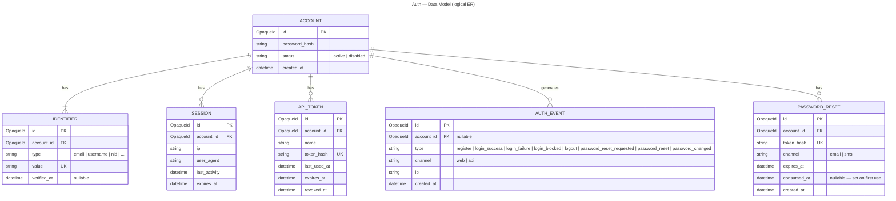

# Auth — Data Model (logical)

Logical entities — *what* is stored, not the physical schema (indexes, column types,
and per-service DB splits come at each level). Mermaid ER, titled.

## Login identifier — one contract, two valid backings

Lookup is generalized to **`findByIdentifier(identifier)`** (email / username / NID / …).
The **contract is fixed**; the **storage is the implementer's choice** — both satisfy
the same port:

- **A — inline (simple):** keep `identifier` + `identifier_type` columns on `ACCOUNT`
  (one identifier per account). Cheapest, no join.
- **B — `IDENTIFIER` table (flexible):** the entity above — an account may have several
  identifiers (email *and* username *and* NID), all resolving to it. Adding a new `type`
  is a data value, not a schema/code change (OCP).

The ER above shows **B**; choose **A** when one identifier per account is enough. `type`
selects a per-type validator (email-format vs username-rules vs NID-format).

## Decision — one Account, not separate user/admin tables  (decided)

A **single `ACCOUNT`** identity table is used. Whether an account is an *admin* is a
**role**, owned by the separate **Authorization** component — **not** an Auth concern.
Authentication only asks "are these credentials valid"; "is this person an admin" is
authorization.

A second identity table (separate *users* and *admins* tables) would duplicate the
same auth flow and credential storage for no benefit — *admin* is an authorization
**role**, not a different way of authenticating (against "one source of truth").

**Confirmed (2026-06-11):** stay with a single `ACCOUNT`. Admin-ness lives in the
Authorization component as a role. (An Admin could become a separate provider later if
a real need appears — not now.)

## Notes
- `password_hash` stores a slow-KDF hash (argon2id/bcrypt); plaintext is never stored.
- `API_TOKEN.token_hash` stores the **hash** of the bearer token; the
  raw token is shown to the client once, at creation.
- `AUTH_EVENT` is included for completeness; auditing is cross-cutting and may move to
  its own component later.
- `id` is opaque / non-enumerable everywhere (no raw auto-increment exposed).
- `PASSWORD_RESET.token_hash` stores the **hash** of the reset secret; the raw token is
  delivered **out-of-band once** and never stored or returned in a response.
- A reset is **usable** only while `consumed_at IS NULL` **and** `expires_at > now`;
  resetting **consumes** the row and **revokes** the account's `SESSION` + `API_TOKEN`
  rows. Change-password revokes the same, **except** the current credential.
