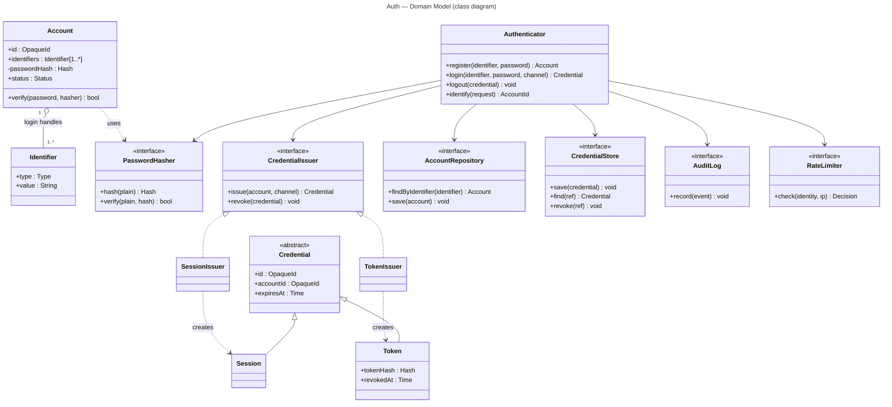

# Auth — Domain Model

Class diagram for the Auth domain (level-independent). It fixes the *types and
relationships*; wiring and deployment are each level's concern.

Design notes:
- **Strategy + registry:** `CredentialIssuer` is chosen by channel from a registry
  (`web → SessionIssuer`, `api → TokenIssuer`). Adding a channel = register a new
  issuer, **not** edit `Authenticator` (OCP).
- **Interfaces at every boundary** (`*Repository`, `*Store`, `PasswordHasher`,
  `RateLimiter`) so Level 2 can swap implementations and Level 3 can move some behind
  the network — without touching `Authenticator`.
- `RateLimiter` and `AuditLog` are interfaces to *external / cross-cutting* providers.
- **Login identifier:** `findByIdentifier` resolves an account by email / username / NID.
  Whether identifiers are stored inline (A) or in a separate table (B) is the
  implementer's choice — see `data-model.md`.
