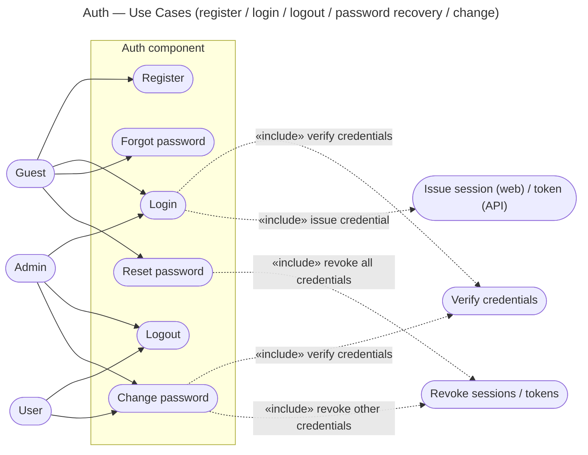

# Auth — Use Cases

Use cases derived from the three stories in `user-stories.md`. Level-independent.

| Use case | Actor(s) | Story | Outcome |
|---|---|---|---|
| Register | Guest | US-1 | account created (hashed password) |
| Login | Guest, Admin | US-2 | credential issued per channel |
| Logout | User, Admin | US-3 | session invalidated / token revoked |
| Forgot password | Guest | US-4 | reset token sent out-of-band; generic reply (no enumeration) |
| Reset password | Guest | US-5 | password replaced, token consumed, **all** credentials revoked |
| Change password | User, Admin | US-6 | password replaced, **other** credentials revoked |

Notes:
- **Login** «includes» *verify credentials* (one shared path) and *issue credential*,
  where issuance is the per-channel strategy fixed in `context.md`.
- **Forgot / Reset** is the **unauthenticated recovery path** — the actor is a Guest
  (locked out). The out-of-band token *is* the proof of identity; on reset, credentials
  are revoked so any old session/token is ejected.
- **Change password** is the **authenticated path** — it «includes» *verify credentials*
  (re-checks the **current** password, not just the session) and revokes the other
  credentials, keeping the current one.
- Admin and User exercise the same use cases; they differ only by **authorization
  role** (separate component) — **not** by the auth flow or identity storage.
