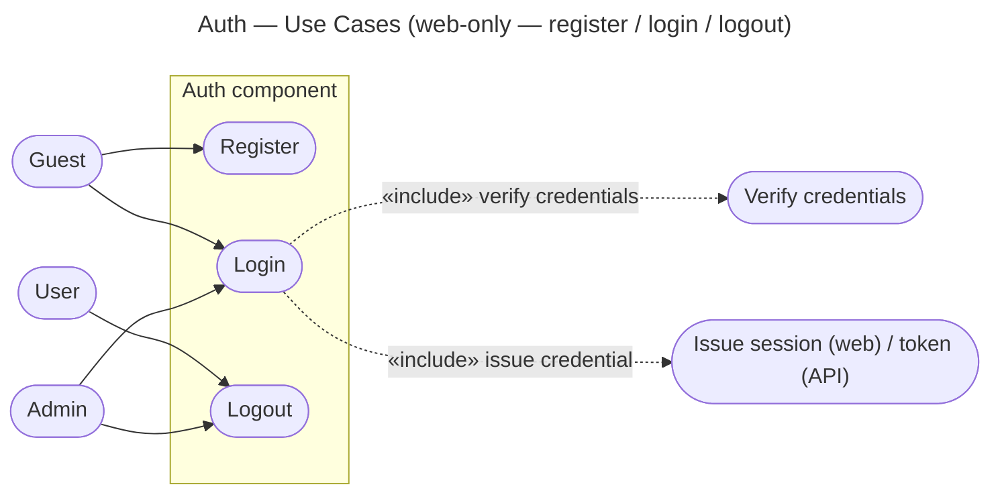

# Auth — Use Cases

Use cases derived from the three stories in `user-stories.md`. Level-independent.

| Use case | Actor(s) | Story | Outcome |
|---|---|---|---|
| Register | Guest | US-1 | account created (hashed password) |
| Login | Guest, Admin | US-2 | credential issued per channel |
| Logout | User, Admin | US-3 | session invalidated / token revoked |

Notes:
- **Login** «includes» *verify credentials* (one shared path) and *issue credential*,
  where issuance is the per-channel strategy fixed in `context.md`.
- Admin and User exercise the same use cases; they differ only by **authorization
  role** (separate component) — **not** by the auth flow or identity storage.
