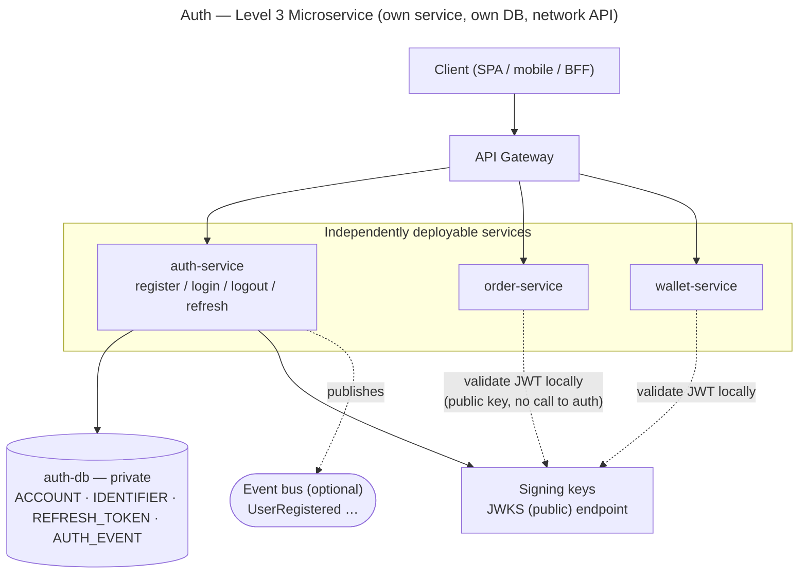

# Auth — Level 3: Microservice

**Level 3 = Auth is its own deployable service, with its own private database and a
network API.** The driving port (`AuthApi`) from Level 2 becomes a **network contract**;
some driven ports now sit across the network. This is where "scale Auth alone" finally
becomes possible — and where every in-process assumption from Levels 1–2 has to be
re-examined.

## Shape

## The big change: stateless tokens

Login issues a **signed access JWT** (short TTL) plus a **refresh token** (stored in
`auth-db`, revocable). Downstream services **validate the JWT locally** with the
public key — **no per-request call to auth-service or auth-db**.

This is the payoff that resolves Level 1's weak spot: identity is now **self-contained
in the token**, so there is no shared session store coupling every instance. "Who is
this user?" went from a *local DB lookup* (L1) / *port call* (L2) to a *local signature
verification* (L3) that every service does independently.

## Data ownership

- `auth-db` is **private to auth-service**. No other service reads or writes it.
- Other services learn identity **only from JWT claims** (`sub = accountId`). If they
  need more user data, they get it via the event bus or a call to auth-service — never
  by touching `auth-db`.

## Web/session channel in a distributed world

Server-side sessions fit a single app, not a fleet of stateless services. Options:
- **BFF (Backend-for-Frontend)** — a thin per-client backend holds the token in an
  HttpOnly cookie and forwards it as a Bearer token. Keeps browsers cookie-safe while
  services stay stateless. **Recommended.**
- A shared session store — works, but re-introduces the central coupling we just removed.

## Trust & keys

- Services trust the **signature**, not a call to auth. The **private key lives only in
  auth-service**; the public key is published via **JWKS** and cached by each service.
- **Key rotation** via `kid` in the JWT header + JWKS — rotate without redeploying
  consumers.
- Note: the JWT proves **who** (identity). **What they may do** (roles/permissions) is
  the separate Authorization component's job — keep roles out of the auth token unless
  deliberately denormalized.

## Failure & resilience

- **auth-service down:** new logins/refreshes fail, but **existing valid access tokens
  keep working until they expire** — graceful degradation, a direct benefit of stateless
  validation.
- **Login is now a network call:** it can time out, be slow, or fail partially — retries,
  timeouts, and idempotency become real concerns that did not exist at L1/L2.

## Revocation challenge (the cost of stateless)

A stateless JWT **cannot be instantly revoked**. Mitigations:
- **Short access-token TTL** (e.g. 5–15 min) + **revocable refresh tokens**.
- Optional **denylist by `jti`** for emergency/instant revocation, kept only until the
  token's `exp`.
- **Logout** revokes the refresh token and (optionally) denylists the current access
  `jti`.

## Requirements revisited

| Requirement | Level-3 status |
|---|---|
| **Horizontal scale (NFR-6)** | **fully met** — scale auth-service alone; validation has no central bottleneck (each service verifies locally). |
| Latency (NFR-8) | login/refresh now incur a network hop; validation stays local and fast. |
| Instant revocation | **weaker** — eventual, via short TTL + denylist. |
| Operational cost | **higher** — more services, key management, tracing, monitoring. |
