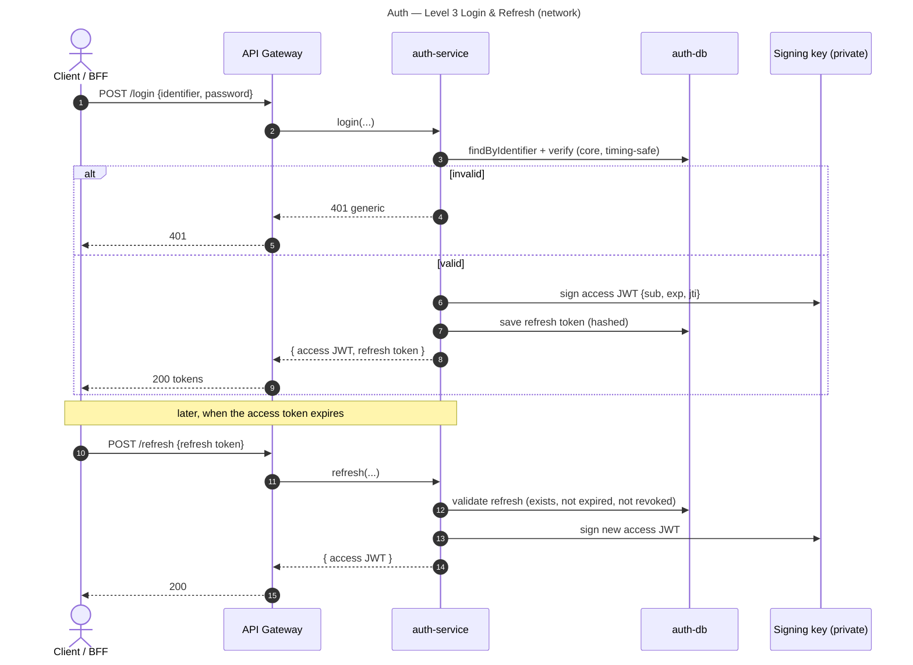
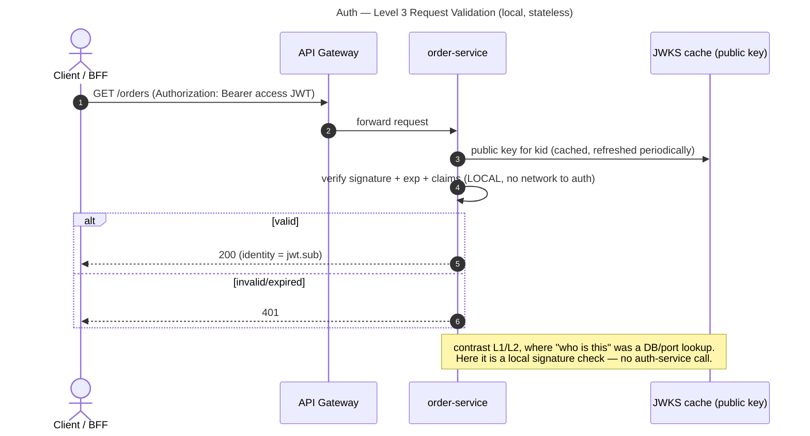

# Auth — Level 3: Sequences

Two flows that capture what changed: **login is now a network call**, and **validating
a request needs no call to auth at all**.

## Login + refresh (network calls to auth-service)

## Authenticated request to another service (NO call to auth)

The second diagram is the whole point of Level 3: identity verification **scales with
each service** and does not funnel back to a single auth datastore.
