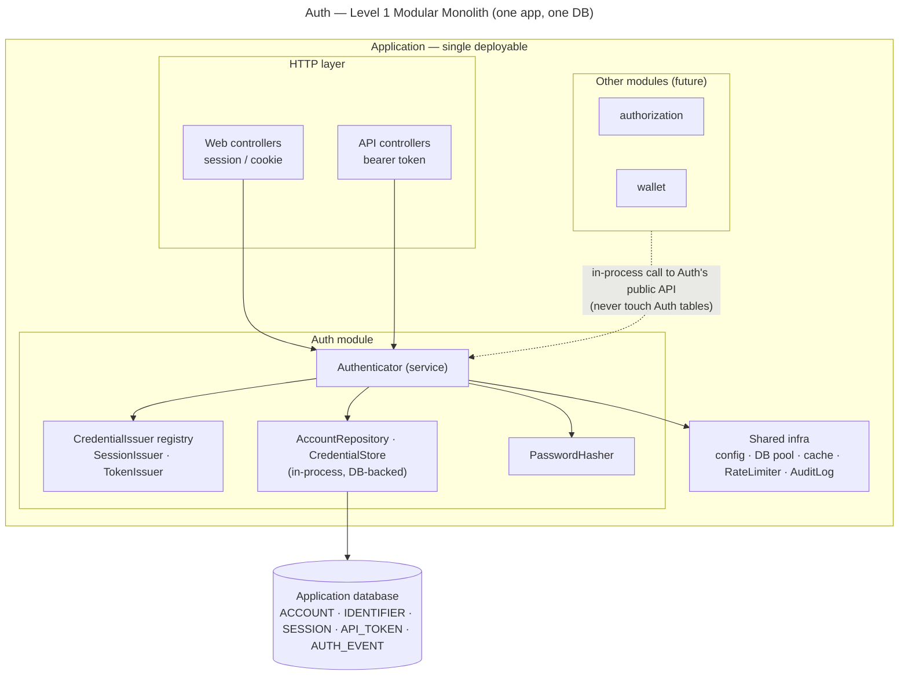

# Auth — Level 1: Modular Monolith Architecture

**Level 1 = one deployable application, one database, in-process calls.** Auth is a
**module** inside that application, beside other modules (future: `authorization`,
`wallet`). The `base/` interfaces get concrete in-process implementations here.

This is the baseline the next two levels are measured against.

## Where Auth sits



## Internal layering (inside the Auth module)

```
HTTP controllers (web + api)   → translate request/response, set cookie or return token
        ↓ in-process call
Authenticator (service)        → business rules; owns the transaction
        ↓
AccountRepository / CredentialStore (pure CRUD)  →  shared DB
```

The `base/` interfaces map to concrete Level-1 implementations — all in-process:

| Base interface | Level-1 implementation |
|---|---|
| `AccountRepository` | repository over the shared DB (Auth's own tables) |
| `CredentialStore` | `SESSION` + `API_TOKEN` rows in the shared DB |
| `PasswordHasher` | in-process slow KDF (argon2id / bcrypt) |
| `CredentialIssuer` (registry) | `SessionIssuer` / `TokenIssuer`, selected by channel |
| `RateLimiter` | in-process limiter backed by the shared cache |
| `AuditLog` | in-process writer to `AUTH_EVENT` / app log |

## Module boundary rules (what keeps this "modular")

- Auth exposes a **small public API** (facade): `register`, `login`, `logout`, and
  `identify(request) → AccountId` so other modules can ask *"who is this request?"*.
- Other modules call that **in-process API only** — they **never** read or write Auth's
  tables directly (sealed boundary).
- Dependencies are **one-directional**: Auth depends on shared infra (DB, cache,
  RateLimiter, AuditLog); it does **not** depend on `authorization` or `wallet`.
- Transactions live in the **service** (`Authenticator`); repositories stay pure CRUD.

## Transaction boundaries

- **Register:** create the `ACCOUNT` (and any initial rows) in **one DB transaction**;
  fail loud on a duplicate identifier (unique constraint), don't swallow it.
- **Login:** verify credentials, then persist the issued credential and write the audit
  event; credential issuance is atomic.
- **Logout:** revoke the session/token and write the audit event atomically.

## How Level 1 meets the base requirements

| Requirement | Level-1 status |
|---|---|
| Password hashing (NFR-1) | yes — in-process KDF |
| No user enumeration (NFR-2) | yes — generic 401 + timing-safe in the service |
| Rate limiting (NFR-3) | yes — in-process limiter on the shared cache |
| Opaque ids (NFR-4) | yes |
| HTTPS + cookie/CSRF (web) / bearer (api) (NFR-5) | yes |
| Audit log (NFR-7) | yes — `AUTH_EVENT` |
| p95 < 200 ms (NFR-8) | easily — no network hops, in-process calls |
| **Horizontal scale (NFR-6)** | **partial** — the app can run N copies behind a load balancer **only if** session/token state lives in a **shared** store (DB/cache), not in process memory. And the **whole app scales together** — you cannot scale Auth alone. |

## The Level-1 lesson (sets up Levels 2–3)

Everything is simple because it is **in one process and one database**: a call is just
a function call, a transaction spans everything, "who is this user" is a local lookup.
The single soft spot is the last row above — **you scale the whole monolith as a
block, and shared session state is the thing tying instances together.** Level 2
tightens the module into a swappable package; Level 3 is where "scale Auth alone"
forces the in-process calls to become network calls — and that changes everything.
