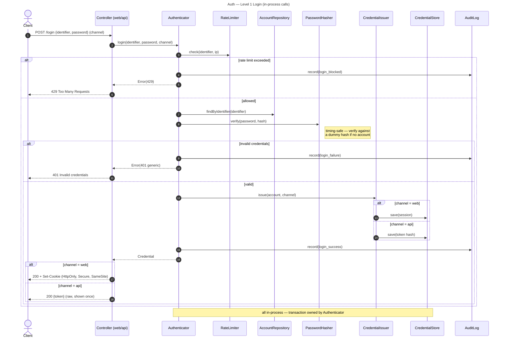
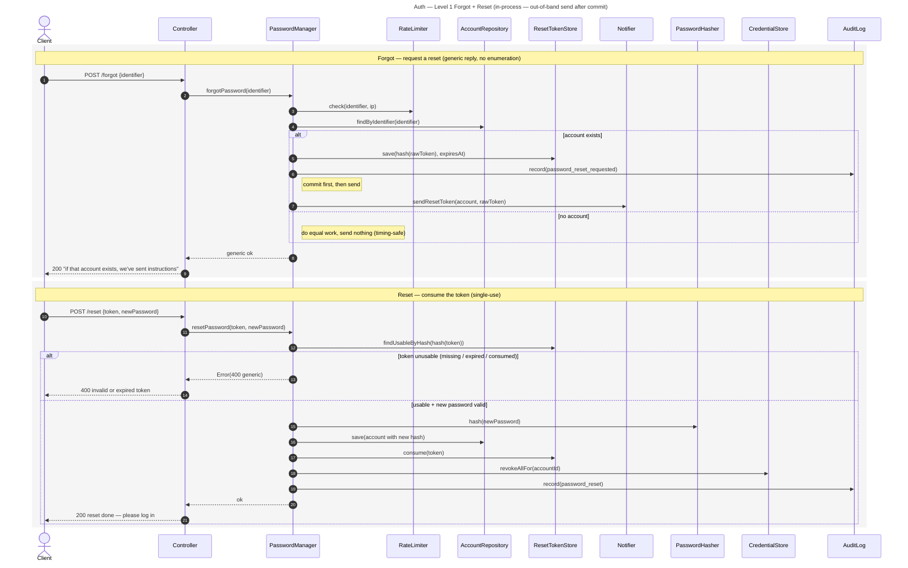

# Auth — Level 1: Sequences

Login shown in full; register and logout follow the same in-process shape (deltas
noted below). **Every arrow is an in-process function call** — one app, one DB.

## Register (delta)
- No rate-limit branch shown above is reused on register too (per-IP).
- `Authenticator.register`: validate input → check identifier uniqueness → `hasher.hash` →
  `accounts.save` in one transaction → `audit.record(register)`.
- Duplicate identifier → explicit `409 identifier already in use` (register may reveal this;
  login stays generic).

## Logout (delta)
- `Authenticator.logout(credential)`: `issuer.revoke(credential)` (invalidate session /
  revoke token row) in one transaction → `audit.record(logout)`.
- Subsequent requests carrying the old credential resolve to "unauthenticated" → 401.

## Forgot + Reset (PasswordManager)

## Change password (delta)
- `PasswordManager.changePassword(accountId, current, newPassword, currentCredential)`:
  load the account → `hasher.verify(current, account.hash)` (**re-authentication** —
  generic, timing-safe error on mismatch) → validate new (policy, **new ≠ old**) → in one
  transaction `hasher.hash`, `accounts.save`,
  `credentialStore.revokeAllFor(accountId, exceptRef = currentCredential)` →
  `audit.record(password_changed)`.
- Same in-process shape as login, but **no out-of-band channel** — the user is already
  authenticated; the proof is the **current password**, not a mailed token.
