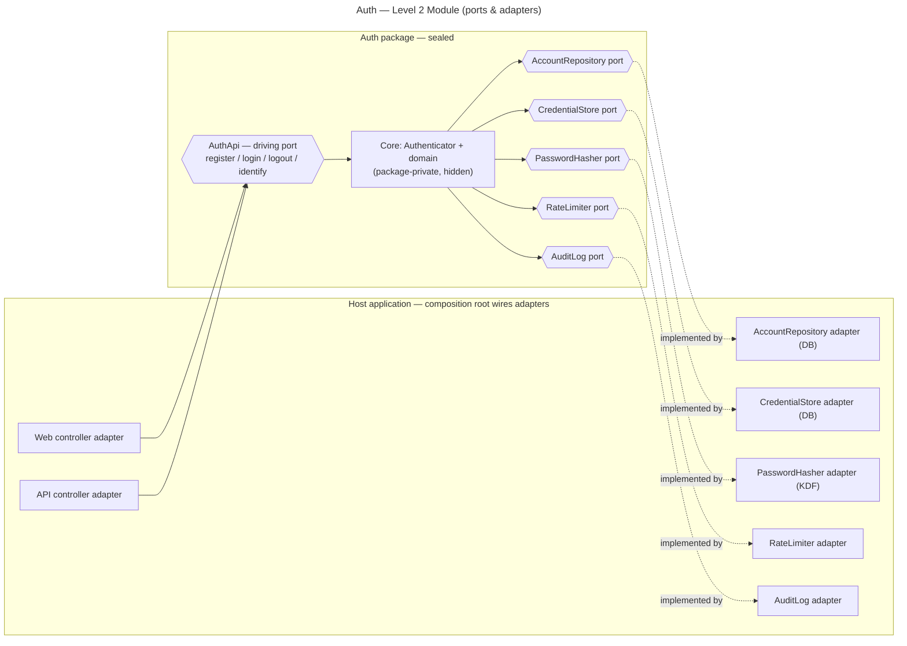

# Auth — Level 2: Module (Ports & Adapters)

**Level 2 = the Auth module extracted into a self-contained package**, with its
boundary enforced by the **package/compiler — not discipline**. Runtime is unchanged
from Level 1 (still one app, one process, in-process calls); what changes is the
**structure**: the core depends only on **ports** (interfaces), and **adapters** are
plugged in from outside (hexagonal / ports-and-adapters).

## Shape



## Ports

- **Driving port** (`AuthApi`) — the only way *in*. Controllers (adapters) call it; they
  cannot reach the core any other way.
- **Driven ports** (`AccountRepository`, `CredentialStore`, `PasswordHasher`,
  `RateLimiter`, `AuditLog`) — the only way *out*. The core declares what it needs; the
  host supplies implementations.
- The core depends on **ports only, never on a concrete adapter** (Dependency Inversion).

## What is hidden vs exported

| Exported (public) | Hidden (package-private) |
|---|---|
| `AuthApi`, the port interfaces, request/response DTOs, error types | `Authenticator` implementation, domain entities' internals, issuer registry, hashing details |

Nothing outside the package can construct or touch the core directly — the compiler
enforces it.

## Composition root (who wires it)

The **host application** assembles the adapters and injects them — the package never
names a concrete implementation:

```
auth = Authenticator(
    accounts      = DbAccountRepository(db),
    credentials   = DbCredentialStore(db),
    hasher        = Argon2Hasher(),
    rateLimiter   = SharedCacheRateLimiter(cache),
    audit         = DbAuditLog(db),
    issuers       = { web: SessionIssuer, api: TokenIssuer },
)
```

## What does NOT change

- **Deployment topology:** still one application, one process, one DB — adapters can use
  the same shared database as Level 1.
- **Therefore the scalability profile is the same as Level 1** — this is a
  *code-structure* level, not a *deployment* level. You do not get independent scaling
  here; you get a clean, swappable, leak-proof boundary.

## What you gain

- **Enforced boundary** — no other module can reach Auth's internals or tables; they
  must go through `AuthApi`.
- **Independent testability** — unit-test the core with **fake adapters**, no DB needed.
- **Swappability** — change DB, hasher, or rate-limiter by writing a new adapter; the
  core is untouched (OCP).
- **Reusability** — drop the package into a different host app by supplying adapters.

## The Level-2 lesson (sets up Level 3)

`AuthApi` is now a **real, explicit contract** instead of an informal facade. That
contract is exactly what becomes a **network API** at Level 3 — and the driven ports
(`CredentialStore`, etc.) are exactly the seams where, at Level 3, an in-process call
becomes a call across the network.
