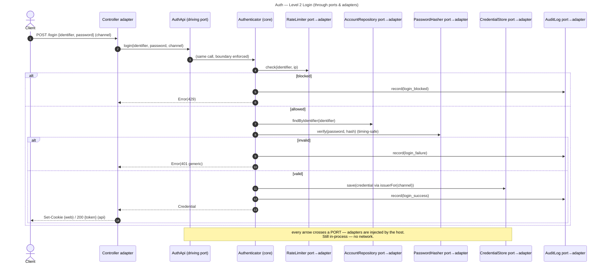

# Auth — Level 2: Sequences

Same login logic as Level 1, but now every crossing goes **through a port**. Still
**in-process** — the value is the enforced boundary, not new runtime behaviour.

Note: the **branch logic is identical to Level 1** (`modular-monolith/sequence.md`).
The only difference is that the core reaches its collaborators **exclusively through
ports**, so each one can be replaced or faked without touching the core.

Register and logout follow the same port-mediated shape.

## Password operations (delta)
- `forgot / reset / change` enter through a second driving port, **`PasswordApi`**, into
  the `PasswordManager` core — same branch logic as Level 1, but every crossing is a port.
- Two extra driven ports appear: **`ResetTokenStore`** (save / findUsableByHash / consume)
  and **`Notifier`** (sendResetToken). The core never names a mail server or a DB table.
- Testability payoff: inject a **fake `Notifier`** that records the raw token, then a test
  can run `forgotPassword(…)` → read the captured token → `resetPassword(token, …)` and
  assert every credential was revoked — **no mail server, no DB**.
