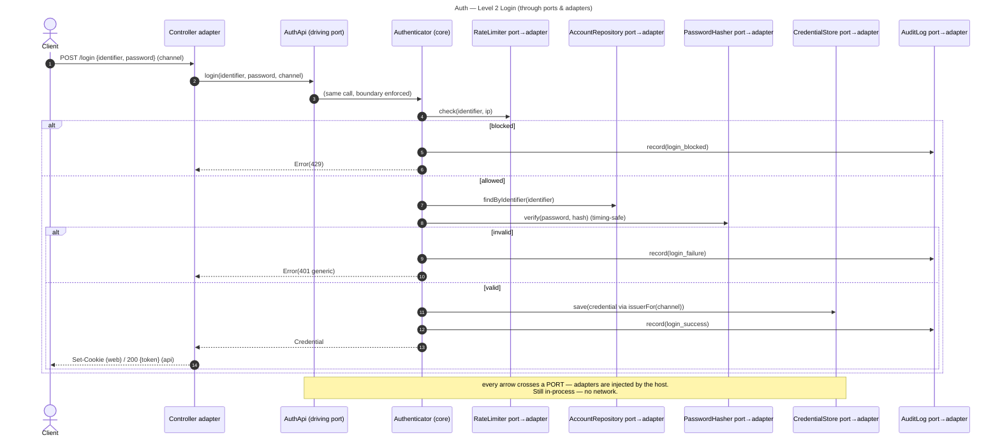

# Auth — Level 2: Sequences

Same login logic as Level 1, but now every crossing goes **through a port**. Still
**in-process** — the value is the enforced boundary, not new runtime behaviour.

Note: the **branch logic is identical to Level 1** (`modular-monolith/sequence.md`).
The only difference is that the core reaches its collaborators **exclusively through
ports**, so each one can be replaced or faked without touching the core.

Register and logout follow the same port-mediated shape.
