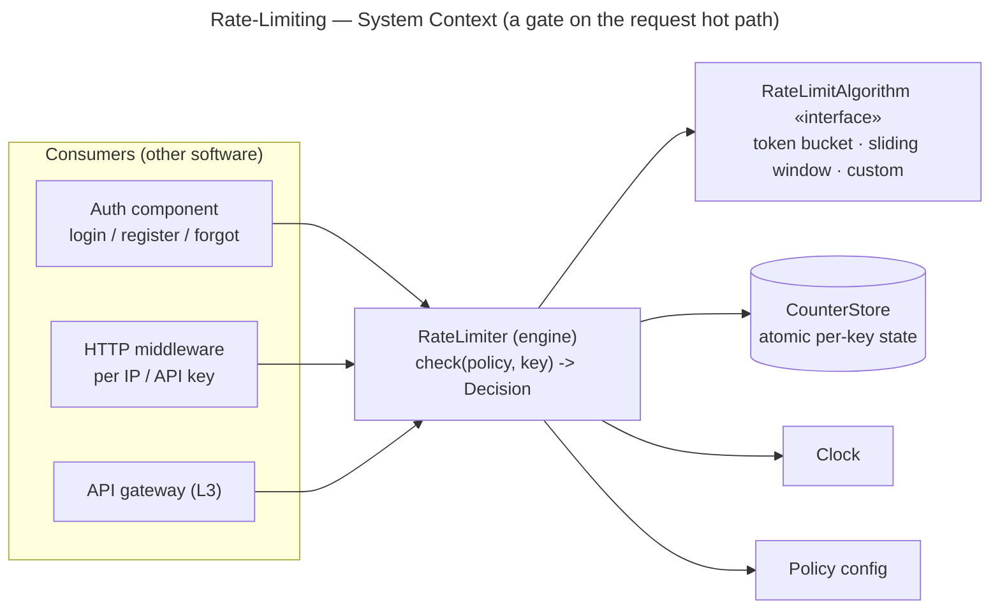
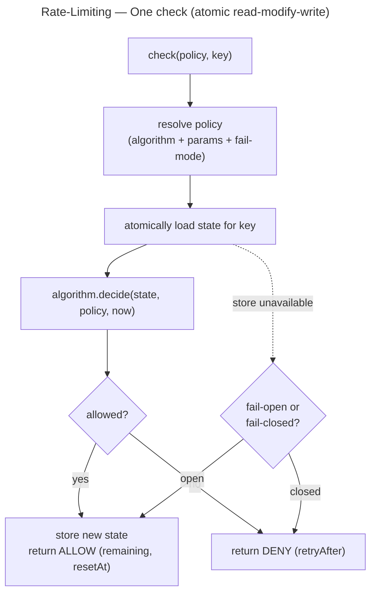

# Rate-Limiting — Context (Environment)

Defines the **environment the Rate-Limiting component runs in**. Shared by all three
levels (modular-monolith / module / microservice) — it describes *where* it lives and
*who* calls it, not *how* the code is split (that is each level's job).

Rate-Limiting is an **infra component**: other components depend on it; it depends on no
domain. Dependencies are **one-directional**.

## Scope (frozen)

- **In:** decide **allow / deny** for an action under a **named policy**, keyed by a
  dimension (IP, identity, route, API key, …); return allow/deny + retry metadata
  (`remaining`, `retryAfter`, `resetAt`). The algorithm is a **pluggable interface**.
  Per-policy **fail-open / fail-closed**.
- **Out / deferred:** billing / usage quotas, concurrency (in-flight) limiting, a dynamic
  per-tenant config UI/service, global distributed quota reconciliation.
- Behaviour + acceptance criteria live in `user-stories.md`.

## What it is (one line)

A **gate**: *"has this key exceeded this policy's limit right now?"* → **allow** (and
count the hit) or **deny** (with how long to wait). It runs on the **request hot path**,
so latency and correctness-under-concurrency both matter.

## Where it runs

| Aspect | Now | Later (noted, not built) |
|---|---|---|
| Form | in-process library inside one app | shared limiter service / edge-gateway plugin |
| Hot path | yes — runs per guarded request | yes |
| State | counters in a store (memory / cache) | shared atomic store / distributed |
| Consumer → limiter call | in-process function call | network call (see L3) |

## Consumers (the "actors" are software, not humans)

| Consumer | Uses it to |
|---|---|
| **Auth component** | throttle login / register / logout / forgot-password (per-identity **and** per-IP) |
| **HTTP middleware** | throttle public endpoints per IP / API key |
| **API gateway** (L3) | edge throttling before requests reach services |

The dependency is **one-directional**: consumers depend on Rate-Limiting; it never
depends on them.

## The model (the key decision)

Three nouns plus the extension seam:

- **Policy** — a named rule: *which algorithm*, the limit params (capacity/refill or
  window/limit), the **key dimension**, and the **fail-mode**. Lives in **config**, not
  code. e.g. `login-per-identity` = token bucket, burst 5, refill 1/min, key = identity,
  fail-closed.
- **Key** — a policy **plus** the concrete dimension value, e.g. `(login-per-ip, 1.2.3.4)`.
  Usually namespaced as `rl:{policy}:{value}`.
- **Decision** — `{ allowed, remaining, limit, retryAfter, resetAt }`.
- **RateLimitAlgorithm «interface»** — the **pluggable strategy** (token bucket /
  sliding-window / fixed-window / a client's own). **This is the extension point.**

The engine ties them together:





## Composing policies (the Auth example)

Auth's **two-bucket** login is not a special feature — it is **two checks AND-ed**:

```
allowed = check("login-per-identity", identifier).allowed
          AND check("login-per-ip", ip).allowed
```

Deny if **either** denies; surface the **longer** `retryAfter`. Any consumer can AND
several policies. This is how Auth's `RateLimiter.check(identity, ip)` maps onto the
general API — the component stays generic, the consumer composes.

## The extension seam (algorithm as an interface)

- `RateLimitAlgorithm` is an **interface**; the built-ins (`TokenBucket`,
  `SlidingWindowCounter`, `FixedWindow`) live in a **registry keyed by name**; a policy
  **names** its algorithm.
- A client **implements the interface + registers it** → a new algorithm with **no engine
  change** (OCP), exactly like Auth's `CredentialIssuer` registry.
- An algorithm is **pure decision logic over state**; **atomicity and persistence are the
  engine / `CounterStore`'s job** — a deliberate separation so each can vary alone.

## Atomicity (the concurrency concern — decided per level)

`check` is a **read-modify-write**. Without atomicity, two concurrent requests both read
"99/100" and **both pass**. The engine must apply the update **atomically** — by
optimistic compare-and-set with retry, or by pushing the whole decision into a
**store-side atomic script**. Which mechanism, and how strong, is decided per level.

## Cross-cutting dependencies (what Rate-Limiting itself needs)

| Dependency | Type | What for |
|---|---|---|
| **CounterStore** | infra (concrete per level) | atomic per-key state |
| **Clock** | injected | refill / window timing (and testability) |
| **Config** | config | policy definitions |
| **Metrics** (optional) | observability | allowed / denied counts |

## Why state-location matters at higher levels (the 1→3 thread — inverted vs Auth)

Auth's arc was stateful → **stateless** (escape the shared store). Rate-Limiting is the
**opposite**: the counter **is** shared state by nature. So its arc is about *keeping a
shared counter correct as you distribute* —

- **L1:** in-process counter — fast, but **wrong across N instances**.
- **L2:** same, behind a `CounterStore` port — swappable, still in-process by default.
- **L3:** the counter must become a **shared atomic store** (a network hop, and the
  limiter's bottleneck) **or** you accept **approximate local counters** synced
  periodically (scale at the cost of exactness).

Each level's `architecture.md` revisits this.

## Deferred questions (decide when the level/need arrives)

- Counter store: in-process map vs shared cache (Redis) vs distributed.
- Atomicity mechanism: compare-and-set retry vs store-side atomic script.
- Default fail-mode (open vs closed) per policy.
- Whether limiting runs in-app, as a sidecar, or at the **gateway** (L3).
