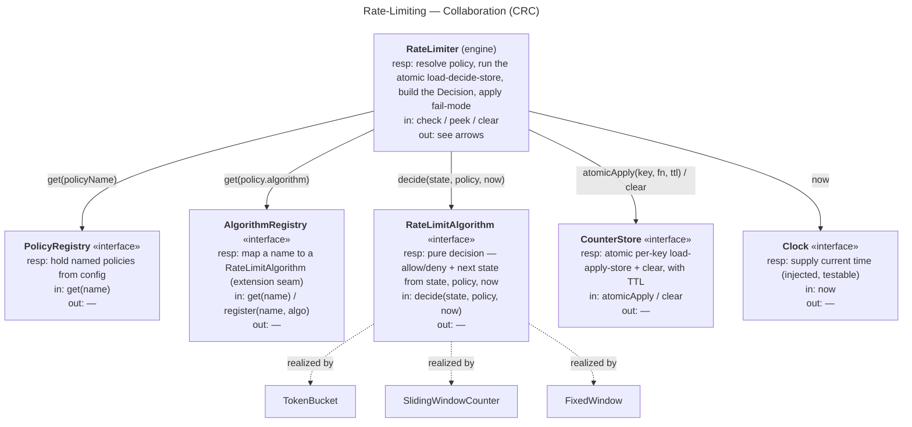

# Rate-Limiting — CRC Cards

Class–Responsibility–Collaborator cards in the message-oriented style — each card shows
**Responsibilities**, **Messages In** (what triggers it), **Messages Out** (what it
sends). Level-independent. Rendered as **card-style flowchart nodes**; the arrows are the
messages.

## Collaboration board

---

## Cards (full responsibilities)

### RateLimiter (engine)
- **Responsibilities:** resolve the policy by name; load the key's state and run the
  algorithm inside an **atomic** update; persist the next state; build the `Decision`;
  apply the **fail-mode** if the store is unreachable.
- **Messages in:** check(policy, key), peek(policy, key), clear(policy, key).
- **Messages out:** get (PolicyRegistry), get (AlgorithmRegistry), atomicApply / clear
  (CounterStore), now (Clock), decide (RateLimitAlgorithm).
- **Collaborators:** PolicyRegistry, AlgorithmRegistry, CounterStore, Clock,
  RateLimitAlgorithm.

### Policy (value)
- **Responsibilities:** name a rule — algorithm, params (capacity/refill or window/limit),
  key dimension, fail-mode. Immutable, from config.
- **Messages in:** —.  **Messages out:** —.
- **Collaborators:** — (data).

### Decision (value)
- **Responsibilities:** carry the result — `allowed`, `remaining`, `limit`, `retryAfter`,
  `resetAt`.
- **Messages in:** —.  **Messages out:** —.
- **Collaborators:** — (data).

### RateLimitAlgorithm «interface»
- **Responsibilities:** given current state + policy + now, decide allow/deny and compute
  the next state — **pure logic, no I/O, no clock of its own**.
- **Messages in:** decide(state, policy, now).
- **Messages out:** —.
- **Collaborators:** — (leaf). **Implementations:** TokenBucket, SlidingWindowCounter,
  FixedWindow.

### CounterStore «interface»
- **Responsibilities:** hold per-key state; apply a mutation **atomically** (no
  read-modify-write race); clear a key; expire idle keys via TTL.
- **Messages in:** atomicApply(key, fn, ttl), clear(key).
- **Messages out:** —.
- **Collaborators:** — (sealed; atomicity lives here).

### Clock «interface»
- **Responsibilities:** supply the current time so refill / window math is testable and
  free of hidden global state.
- **Messages in:** now.
- **Messages out:** —.
- **Collaborators:** — (leaf).

### PolicyRegistry / AlgorithmRegistry «interfaces»
- **Responsibilities:** resolve a name to a `Policy` / a `RateLimitAlgorithm`. The
  algorithm registry is the **extension seam** — register a custom algorithm by name.
- **Messages in:** get(name) / register(name, algorithm).
- **Messages out:** —.
- **Collaborators:** — (built from config + code).
