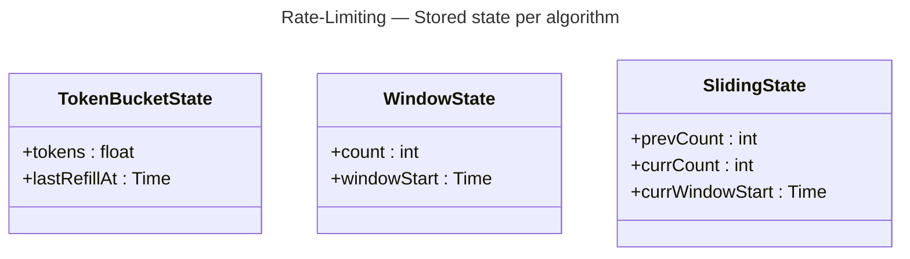

# Rate-Limiting — Data Model (logical)

Logical state — *what* is stored per key, not the physical store (that is each level's
job: in-process map, Redis, …). Storage is **key → value**, not relational: a fast store
that supports an **atomic** update and **TTL**.

## Key

```
key = "rl:" + policyName + ":" + normalize(dimensionValue)
```

- `dimensionValue` is the IP / identifier / route the policy keys on.
- `normalize` lower-cases / trims / **length-bounds** (and may hash) the value so a forged
  or huge input cannot blow up memory or collide keys (NFR-12).

## Per-key state (one record shape per algorithm)



| Algorithm | State fields | TTL (expire idle keys) |
|---|---|---|
| Token bucket | `tokens`, `lastRefillAt` | ~ time to refill to full |
| Fixed window | `count`, `windowStart` | one window length |
| Sliding window counter | `prevCount`, `currCount`, `currWindowStart` | two window lengths |

## Rules

- **Atomic value update:** the value is read-modified-written **atomically** — a
  store-side script or compare-and-set retry — so two concurrent checks cannot both pass
  at the limit (NFR-1).
- **TTL is mandatory:** every key expires after its horizon above, so abandoned keys
  (one-off IPs) do not accumulate — bounded memory (NFR-9).
- **State is opaque to consumers:** only the engine reads / writes it; consumers see a
  `Decision`, never the counters.
- **Header derivation:** `RateLimit-Limit = policy.limit`, `RateLimit-Remaining =
  decision.remaining`, `RateLimit-Reset = decision.resetAt` — computed from the
  `Decision`, not stored.

## Note — why not a relational table

A relational row per hit (or per key) would add a transaction + index cost on the **hot
path** and would not give cheap TTL. Rate limiting wants **O(1) key access, atomic
update, automatic expiry** — the shape of a **cache**, not a ledger. (Auditing *denials*
for security can still be logged separately, the way Auth logs `AUTH_EVENT`.)
