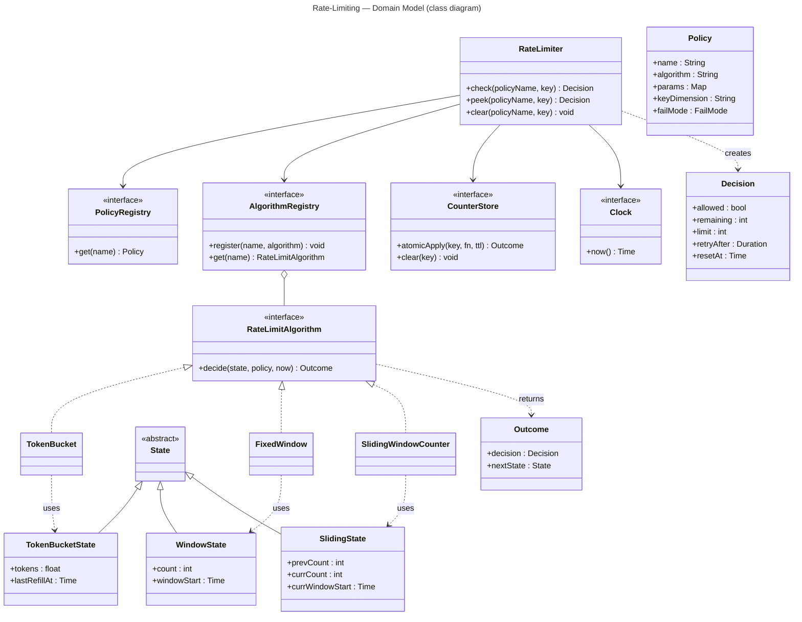

# Rate-Limiting — Domain Model

Class diagram (level-independent). It fixes the types and the **extension seam**; wiring
and the concrete store are each level's concern.

Design notes:
- **Strategy + registry (the extension point):** `RateLimitAlgorithm` is selected by name
  from `AlgorithmRegistry`. A client adds an algorithm by **implementing the interface and
  registering it** — `RateLimiter` never changes (OCP), exactly like Auth's
  `CredentialIssuer` registry. The three built-ins ship in the box.
- **Algorithm is pure:** `decide(state, policy, now)` does **no I/O and reads no clock** —
  `now` is passed in. Each algorithm is trivially unit-testable, and atomicity stays out
  of it.
- **Atomicity lives in `CounterStore.atomicApply`:** the engine hands the store a function
  `fn(state) -> Outcome`; the store applies it **atomically** (store-side script or
  compare-and-set retry) so concurrent checks cannot double-admit. *How* is each level's
  job. (The algorithm's `decide` is what `fn` calls.)
- **State shapes differ per algorithm** but are all tiny (2–3 fields) and carry a TTL.
- `Clock` is an interface so refill / window timing is deterministic in tests.
