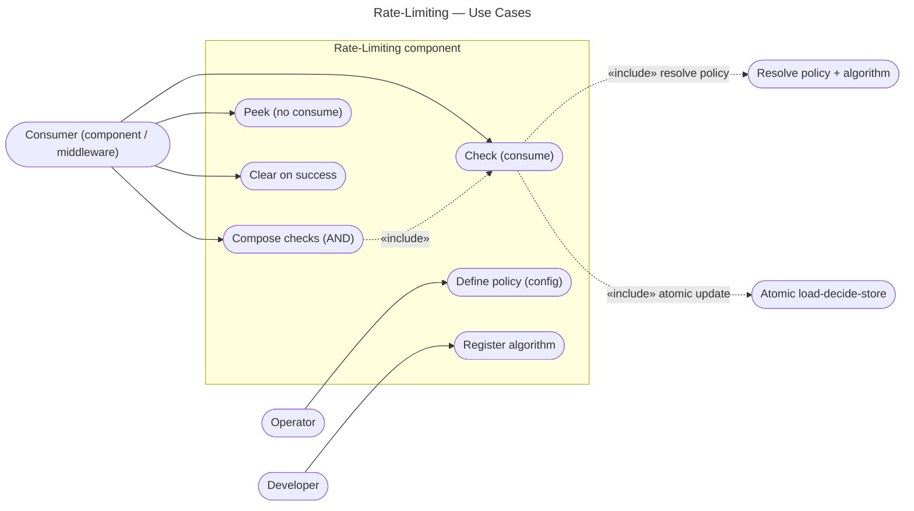

# Rate-Limiting — Use Cases

Use cases from the stories in `user-stories.md`. Level-independent. The actors are mostly
**software** (a consuming component), plus a human **operator** and **developer**.

| Use case | Actor | Story | Outcome |
|---|---|---|---|
| Check (consume) | Consumer | US-1 | allow (counted) or deny (`retryAfter`) |
| Compose checks | Consumer | US-2 | deny if any denies; `retryAfter` = max |
| Peek | Consumer | US-6 | current view, no mutation |
| Clear on success | Consumer | US-3 | key reset |
| Define policy | Operator | US-4 | new named policy, no code change |
| Register algorithm | Developer | US-5 | new strategy, no engine change |

Notes:
- **Check** «includes» *resolve policy* (name → algorithm + params + fail-mode) and the
  *atomic load-decide-store* — the heart of the component.
- **Compose** is just **Check** run per policy and AND-ed by the consumer — not a separate
  engine feature.
