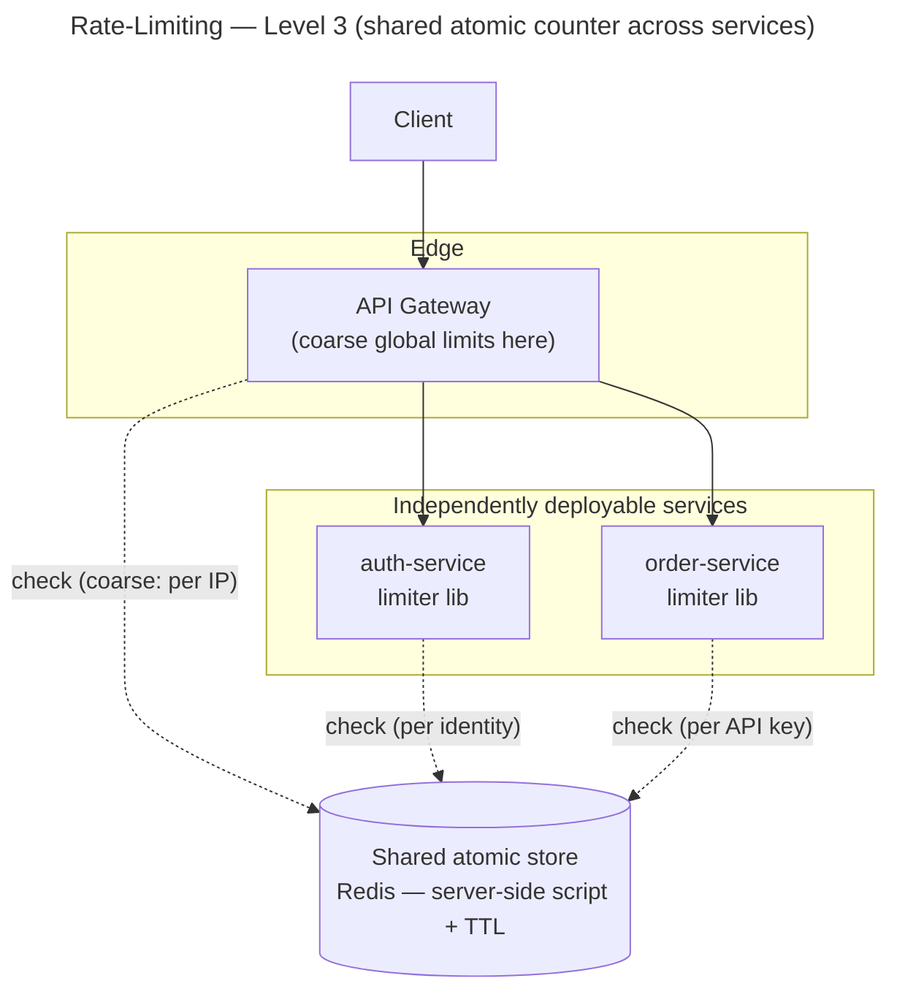

# Rate-Limiting — Level 3: Shared / Distributed

**Level 3 = the limit must hold across many instances or services**, so the counter can no
longer live in a process. It moves to a **shared atomic store**, or goes **approximate and
local**. This is the inverse of Auth's Level 3: Auth *removed* the shared store (stateless
JWT); rate-limiting **cannot** — the count is inherently global.

## Shape

## Atomicity over the network (the crux)

A client-side **load → decide → store** over the network is a **race**: two instances both
read "1 token left" and both write "0". Two ways to stay atomic:

| Approach | How | Trade-off |
|---|---|---|
| **Store-side script** (hot keys) | push the whole token-bucket `decide` into a server-side atomic script (Redis Lua / stored proc) | one round-trip, atomic, fast — **but** the algorithm logic now lives in the store, so a custom algorithm must also ship a script |
| **Optimistic CAS retry** (default) | read state + version, run the **pure** `decide` client-side, write back with compare-and-set; retry on conflict | keeps the pluggable pure algorithm (the extension seam) — **but** costs extra round-trips under contention on hot keys |

**Recommended:** CAS retry by default (preserves the pure, pluggable `RateLimitAlgorithm`);
move proven **hot keys** to a store-side script when the round-trips hurt.

## Where the limiter runs

- **In each service (library)** calling the shared store — granular, per-business-key;
  every service now depends on the store.
- **At the gateway / edge** — coarse global limits (per IP / route) before fan-out; cheap
  and central, but blind to business keys.
- **Sidecar** — offload to a co-located proxy so app code stays clean.

Common shape: **coarse at the gateway + fine-grained in services**.

## Scaling the shared counter (exact vs approximate)

- **Central store** is exact-ish but adds a **network hop on every check** and is a
  **bottleneck / SPOF** — the mirror of Auth's "call auth per request." Mitigate with an
  HA cluster and **sharding by key**.
- **Approximate local counters** — each instance owns a slice of the budget
  (`global / N`) or batches increments and syncs periodically. Scales with no per-check
  hop, but **overshoots** the global limit (sloppy). Good when approximate is acceptable;
  add it as a **distribution-friendly algorithm** via the `RateLimitAlgorithm` port.

## Fail-mode when the store is down

Per-policy and explicit (NFR-3): security-critical limits (login) **fail-closed** (deny,
or degrade to a strict local cap); public reads **fail-open** (allow). Never undefined.

## Requirements revisited

| Requirement | Level-3 status |
|---|---|
| **Correct across instances (NFR-1)** | **met** — shared atomic store (script or CAS) |
| Low overhead (NFR-2) | a network hop per check (central) — or near-zero (approximate local) |
| Availability (NFR-3) | the store is now a dependency — needs HA + explicit fail-mode |
| Extensibility (NFR-6) | pure algorithm preserved under **CAS**; a **store-side script** duplicates the logic |
| Operational cost | **higher** — HA store, sharding, placement, monitoring |
