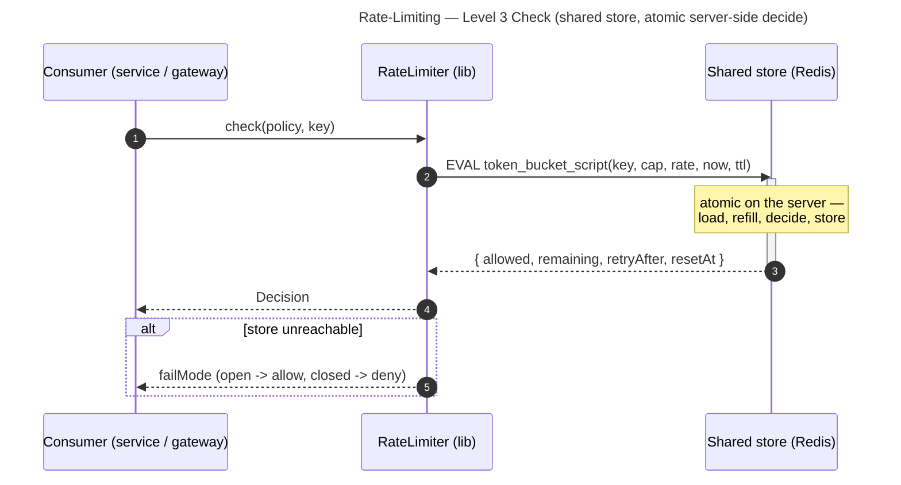

# Rate-Limiting — Level 3: Sequences

The check is now a **network call to a shared store**, and the read-modify-write must be
atomic **on the store side**.

## Check via shared store (atomic server-side decide)

## CAS-retry variant (delta — keeps the pure algorithm)
- Instead of a server-side script, the lib does: read state + version → run the **pure**
  `decide` locally → `compareAndSet(key, version, nextState)`.
- On a version conflict (another instance won the race), **retry** with fresh state, up to
  N times; exhausting retries surfaces to the **fail-mode**.
- Preserves the pluggable pure algorithm; costs extra round-trips on hot keys.

## Approximate-local variant (delta — scale over exactness)
- Each instance owns a budget slice (`global / instanceCount`) refilled by a periodic
  sync; `check` consumes from the **local** bucket with **no per-check hop**.
- Overshoots the global limit by up to `instanceCount - 1` — accepted when approximate is
  fine. Plugged in as a `RateLimitAlgorithm` implementation, so the engine is unchanged.
