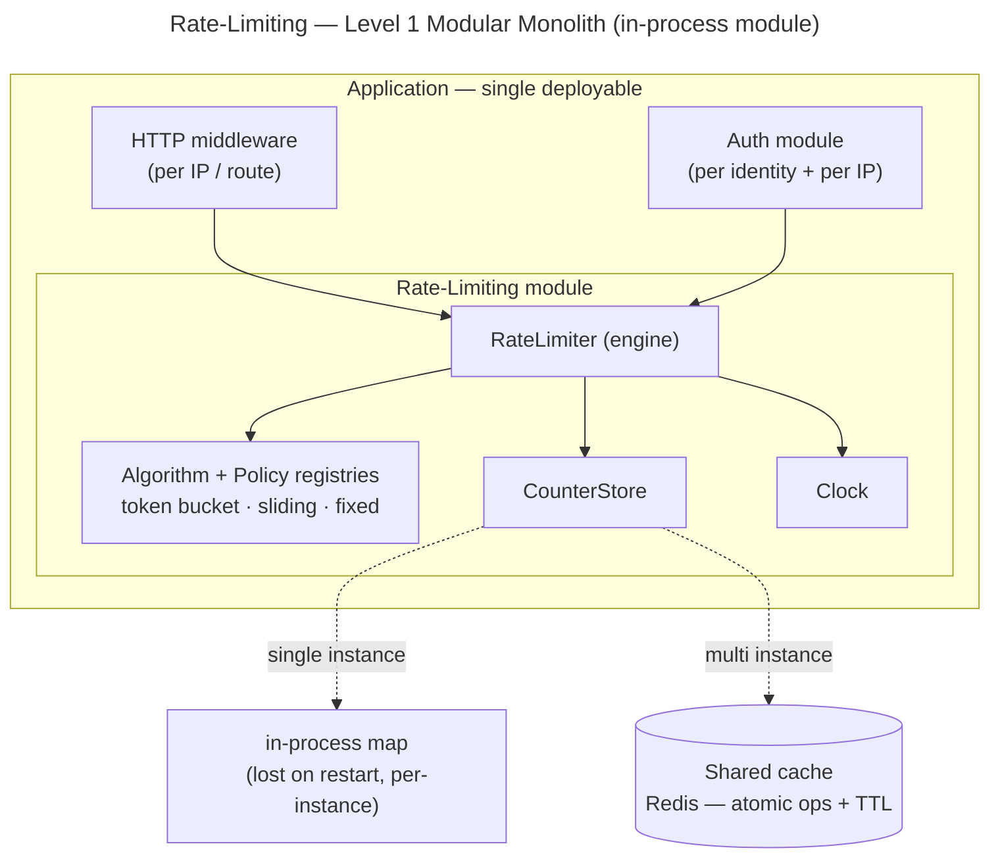

# Rate-Limiting — Level 1: Modular Monolith Architecture

**Level 1 = one deployable application; rate-limiting is a module inside it, called
in-process.** The `base/` interfaces get concrete in-process implementations. This is the
baseline the next two levels are measured against.

## Where it sits



## Internal layering

```
Consumer (middleware / Auth module)   → derives the key, calls check
        ↓ in-process call
RateLimiter (engine)                  → resolve policy, run atomic load-decide-store
        ↓
CounterStore (atomic per-key state)   →  in-process map  OR  shared cache
```

The `base/` interfaces map to concrete Level-1 implementations:

| Base interface | Level-1 implementation |
|---|---|
| `CounterStore` | in-process concurrent map + per-key lock **(single instance)**, or a shared cache with atomic ops **(multi-instance)** |
| `RateLimitAlgorithm` (registry) | `TokenBucket` / `SlidingWindowCounter` / `FixedWindow`, in-process |
| `Clock` | the system clock |
| `PolicyRegistry` | policies loaded from config at startup (fail loud on unknown algorithm) |
| `Metrics` | in-process counters |

## Atomicity at Level 1

`atomicApply` is where correctness-under-concurrency lives:

- **In-process map:** acquire a **per-key lock**, load → `decide` → store, release. Atomic
  *within one process only*.
- **Shared cache:** a **server-side atomic op** (atomic increment for fixed-window, or a
  small server-side script for token bucket) — no app-side lock, and correct **across
  instances**. This is already the Level-3 shape.

## The Level-1 lesson (the scaling wall comes early)

Auth could live happily as a monolith for a long time. Rate-limiting **cannot** — its
correctness depends on a **single shared counter**, so:

> The instant you run **two app instances** behind a load balancer, an **in-process**
> counter splits into two independent counters → the effective limit **doubles** (×N for
> N instances).

So the "shared store" pressure that Auth only meets at Level 3 shows up for rate-limiting
**as soon as you scale horizontally at all**. The honest Level-1 baseline for any
multi-instance app is therefore **in-process engine + shared atomic cache** — structurally
the same counter Level 3 formalizes; Levels 2–3 are about making that swap clean and
making the shared counter scale.

## How Level 1 meets the base requirements

| Requirement | Level-1 status |
|---|---|
| Atomic check (NFR-1) | yes — per-key lock (in-process) or atomic op (shared cache) |
| Low overhead (NFR-2) | in-process map is ~free; shared cache adds one round-trip |
| Fail-mode (NFR-3) | shared-cache errors → per-policy fail-open / fail-closed; in-process map cannot fail over the network |
| Config-driven (NFR-5) | yes — policies from config at startup |
| Extensible algorithm (NFR-6) | yes — registry of `RateLimitAlgorithm` |
| Bounded state (NFR-9) | shared cache: native TTL; in-process map: needs a sweep / lazy eviction |
| Correct across instances | **only with a shared store** — the in-process map is single-instance |
