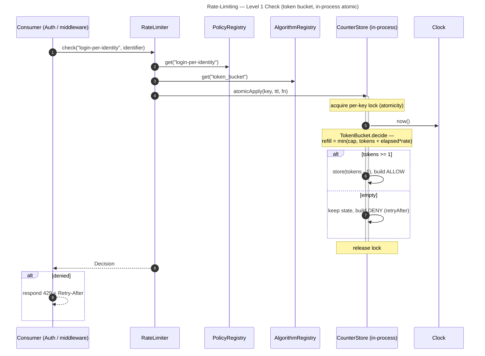

# Rate-Limiting — Level 1: Sequences

Token bucket shown in full; the other algorithms plug into the same `decide` step.
**Every arrow is an in-process call.**

## Check (token bucket, in-process atomic)

## Compose — Auth's two buckets (delta)
- Auth ANDs two checks: `check("login-per-identity", id)` and `check("login-per-ip", ip)`.
- **Denied if either denies**; the surfaced `retryAfter` is the **larger** of the two.
- This is consumer-side composition — the engine has no special "two-bucket" mode.

## Clear on success (delta)
- After a successful login, Auth calls `clear("login-per-identity", id)` (and the IP key)
  so a legitimate user is not left throttled by earlier failures.
- `clear` removes the key's state — the next `check` starts from a full bucket.
