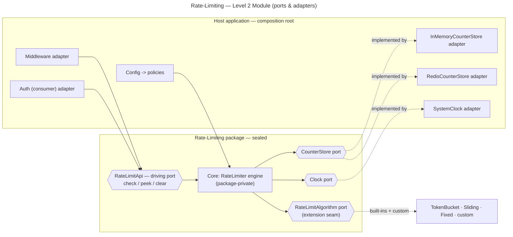

# Rate-Limiting — Level 2: Module (Ports & Adapters)

**Level 2 = the rate-limiting module extracted into a sealed package**, its boundary
enforced by the **package/compiler, not discipline**. Runtime is unchanged from Level 1
(in-process); what changes is the **structure**: the core depends only on **ports**, and
adapters are injected. The `RateLimitAlgorithm` interface — already the extension seam —
becomes a first-class **port** a client implements from outside.

## Shape



## Ports

- **Driving port** (`RateLimitApi`) — the only way *in*: `check` / `peek` / `clear`.
- **Driven ports** — `CounterStore` (atomic state), `Clock` (time), and
  `RateLimitAlgorithm` (the **pluggable strategy**). The first two are infra the host
  supplies; the third is the **extension point** — a client registers its own.
- The core depends on **ports only** (Dependency Inversion).

## What is hidden vs exported

| Exported (public) | Hidden (package-private) |
|---|---|
| `RateLimitApi`, the port interfaces (incl. `RateLimitAlgorithm`), `Policy` / `Decision` types | the `RateLimiter` engine, the registry wiring, the built-in algorithm internals |

## Composition root (who wires it)

The host registers algorithms (built-in + custom), loads policies from config, and picks
a `CounterStore` adapter:

```
rl = RateLimiter(
    policies   = PolicyRegistry(config.policies),         // fail loud on unknown algorithm
    algorithms = registry()
                   .register("token_bucket",   TokenBucket())
                   .register("fixed_window",   FixedWindow())
                   .register("sliding_window", SlidingWindowCounter())
                   .register("my_algo",        MyAlgorithm()),   // client extension, no engine change
    store      = config.useRedis ? RedisCounterStore(redis) : InMemoryCounterStore(),
    clock      = SystemClock(),
)
```

## What does NOT change

- **Deployment topology:** still one process — adapters can use the same in-process map or
  a shared cache, exactly as at Level 1.
- **Scalability profile is unchanged** — this is a *code-structure* level. A shared,
  correct-across-instances counter still requires choosing a shared-store adapter (or
  Level 3).

## What you gain

- **Enforced boundary** — consumers go through `RateLimitApi`; nothing reaches the engine.
- **Swappable store** — in-memory ↔ Redis by changing one adapter; the core is untouched.
- **First-class extensibility** — `RateLimitAlgorithm` is a port, so a client ships a
  custom algorithm **without forking** the package (the seam you asked for, enforced).
- **Unit-testable algorithms** — with a **fake `Clock`** + in-memory store, refill / window
  behaviour is tested deterministically with **zero infrastructure and zero real time**.

## The Level-2 lesson (sets up Level 3)

`RateLimitApi` is now an explicit contract, and `CounterStore` is an explicit seam. At
Level 3 the `CounterStore` adapter is exactly where a **shared, distributed** store plugs
in — and the `RateLimitAlgorithm` port is where a **distribution-friendly (approximate)**
algorithm can be added without touching the engine.
