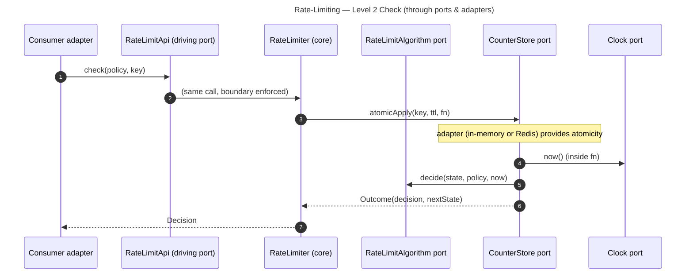

# Rate-Limiting — Level 2: Sequences

Same `check` logic as Level 1, but every crossing goes **through a port**. The new value
is the enforced boundary and the **fake-clock testability** — not new runtime behaviour.



The branch logic is identical to Level 1; the core reaches the store, clock, and algorithm
**exclusively through ports**, so each can be replaced or faked.

## Why it matters — a deterministic algorithm test (fake clock, no infra)

```
function test_token_bucket_refills_over_time():
    clock = FakeClock(at = t0)
    rl = RateLimiter(
        policies   = PolicyRegistry({ "api": Policy(algorithm = "token_bucket",
                                                    params = { capacity: 2, refillPerSec: 1 }) }),
        algorithms = registry().register("token_bucket", TokenBucket()),
        store      = InMemoryCounterStore(),
        clock      = clock)

    assert rl.check("api", "k").allowed == true      // 2 -> 1
    assert rl.check("api", "k").allowed == true      // 1 -> 0
    assert rl.check("api", "k").allowed == false     // empty -> DENY

    clock.advance(1 second)                          // refill exactly 1 token
    assert rl.check("api", "k").allowed == true      // 1 -> 0 again
```

The fake clock makes refill **deterministic** — the algorithm is exercised with zero real
time and zero infrastructure, the proof that `decide` is pure and the boundary is real.
